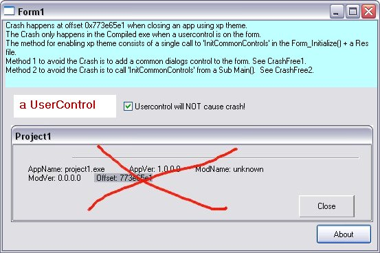



## Avoiding XP Theme Crash

### Description

Study of why vb6 applications with xp theme enabled sometimes crashes when closed. I have included an example of an application that crashed and two examples to show how to prevent it from crashing. Conclusions: It seems to be related to XP Theme not being closed correctly when an internal vb6 UserControl is placed on the main form.

A simple way to fix this is to ensure it gets cleaned up either by placing an imagelist or a commond dlg control on the form.

Unzip the download and compile each of the 3 examples and study the source. I have tried to keep it as simple as possible. Votes appreciated :)
 
### More Info
 

             |
---                |---
**Submitted On**   |2007-12-21 01:39:22
**By**             |[DracullSoft](https://github.com/Planet-Source-Code/PSCIndex/blob/master/ByAuthor/dracullsoft.md)
**Level**          |Advanced
**User Rating**    |4.8 (19 globes from 4 users)
**Compatibility**  |VB 5\.0, VB 6\.0
**Category**       |[Custom Controls/ Forms/  Menus](https://github.com/Planet-Source-Code/PSCIndex/blob/master/ByCategory/custom-controls-forms-menus__1-4.md)
**World**          |[Visual Basic](https://github.com/Planet-Source-Code/PSCIndex/blob/master/ByWorld/visual-basic.md)
**Archive File**   |[Avoiding\_X20945512202007\.zip](https://github.com/Planet-Source-Code/dracullsoft-avoiding-xp-theme-crash__1-69786/archive/master.zip)

